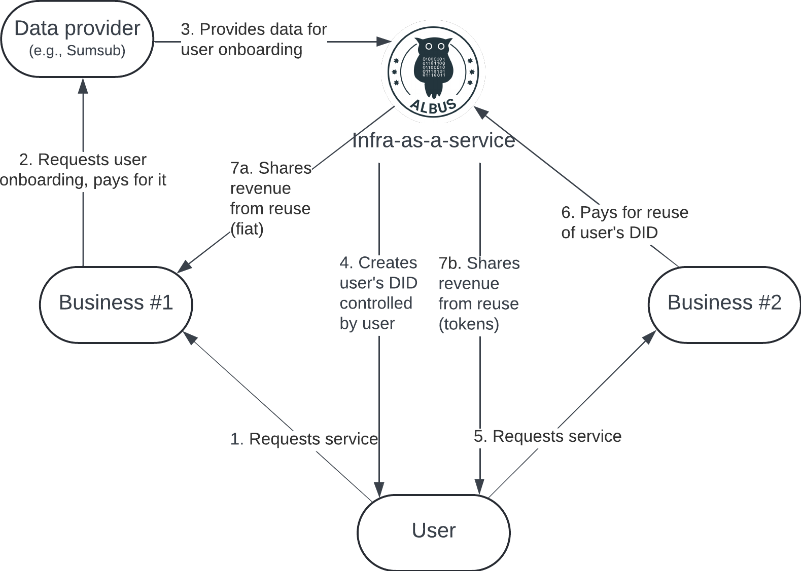

---
layout:
  title:
    visible: true
  description:
    visible: false
  tableOfContents:
    visible: true
  outline:
    visible: true
  pagination:
    visible: true
---

# Revenue-Sharing Model

<figure><figcaption></figcaption></figure>

When a user requests a service from a business and doesn't have the neccessary identity data to pass the verification required by the business, this business pays for the user's onboarding to a data provider (such as Sumsub). The data provider then supplies the required identity data to Albus Protocol. Albus, acting as an infrastructure-as-a-service platform, steps in to create and store a decentralized identity (DID) for the user. This DID is fully controlled by the user.

Whenever, the user wants to request a service from another business, this business can reuse the user’s existing DID. The revenue generated from this DID reuse is then distributed among the participants. A portion of the revenue is returned in fiat to the business that paid for the user onboarding, while another portion is allocated to the user in the form of tokens.
